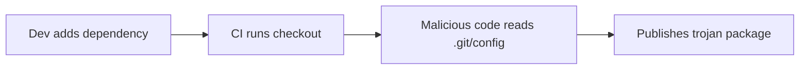
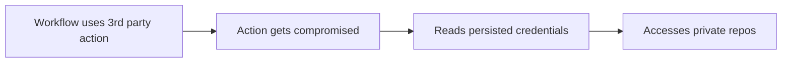

# OpenSSF Talk: "Catching GitHub Actions Red-Handed"
## Supply Chain Security Vulnerabilities in CI/CD Pipelines

### Talk Outline and Demo Script

---

## 🎯 **Introduction (5 minutes)**

### Opening Hook
> "What if I told you that your trusted CI/CD pipeline has been silently exposing your secrets for years, and you never knew it?"

### Problem Statement
- Open-source companies face unique challenges balancing open code with private credentials
- CI/CD pipelines often have insecure defaults that create hidden attack vectors
- A 2-year-old token with no expiration became a critical vulnerability

### Talk Agenda
1. Real-world vulnerability demonstration
2. Forensic investigation walkthrough  
3. Attack vector analysis
4. Practical mitigation strategies

---

## 🕵️ **Live Demo: Catching GitHub Actions Red-Handed (15 minutes)**

### Demo Setup
```bash
# Show the vulnerable repository
cd /path/to/demo-repo
tree -a -L 3
```

### Part 1: The Vulnerable Workflow (5 minutes)
**Show**: `vulnerable-workflow.yml`

```yaml
# 🚨 VULNERABILITY: Missing persist-credentials: false
- uses: actions/checkout@v4
  # This persists GitHub token in .git/config!
```

**Demo Points**:
- Default behavior is insecure
- Credentials silently persisted in `.git/config`
- Every subsequent step has access to tokens

### Part 2: Running the Exploit (5 minutes)
**Execute**: 
```bash
# Run the exploit demonstration
./scripts/exploit-demo.sh
```

**Highlight**:
- How credentials are extracted from `.git/config`
- Environment variable access
- Potential for supply chain injection

### Part 3: Supply Chain Impact (5 minutes)
**Show**: Package and container publication simulation

```bash
# NPM package compromise simulation
npm pack --dry-run

# Docker image compromise simulation  
docker build -t vulnerable-demo:latest .
```

**Key Points**:
- Legitimate credentials used for malicious purposes
- Published packages appear trustworthy
- Wide distribution of compromised software

---

## 🔍 **Forensic Investigation Deep Dive (10 minutes)**

### Our Real-World Incident
- **Timeline**: 2-year exposure window
- **Scope**: Multiple registries (npm, PyPI, Docker Hub)
- **Impact**: Potential access to signing credentials

### Investigation Methodology

#### 1. Registry Image Diffing
```bash
# Example of how we detected anomalies
docker history suspicious-image:latest
docker diff image1 image2
```

#### 2. Cross-Registry Scanning
```bash
# Scanning across multiple package managers
npm audit --audit-level high
pip-audit --format json
trivy image compromised-image:tag
```

#### 3. Token Tracing
```bash
# Following the credential trail
git log --all --grep="token"
grep -r "credential" .github/workflows/
```

### Key Findings
- Misconfigured checkout action exposed tokens
- No token expiration or rotation policy
- Lack of audit logging and monitoring
- Multiple attack vectors remained undetected

---

## ⚔️ **Attack Vector Analysis (8 minutes)**

### Attack Taxonomy

#### 1. Direct Token Extraction
```bash
# How attackers access credentials
cat .git/config | grep -A5 credential
env | grep GITHUB_TOKEN
```

#### 2. Supply Chain Injection
- **NPM**: Publish malicious packages with legitimate credentials
- **Docker**: Push compromised images to registries
- **PyPI**: Distribute backdoored Python packages

#### 3. Lateral Movement
- Access private repositories
- Escalate to organization-level permissions
- Exfiltrate sensitive source code and secrets

### Real Attack Scenarios

#### Scenario A: Malicious Dependency


#### Scenario B: Compromised Action


### Why This Attack is So Effective
- **Stealth**: Uses legitimate credentials
- **Scale**: Affects entire supply chain
- **Persistence**: Can remain undetected for years
- **Trust**: Published artifacts appear legitimate

---

## 🛡️ **Practical Security Improvements (12 minutes)**

### Immediate Fixes (Demo the secure workflow)

#### 1. Secure Checkout Configuration
```yaml
- uses: actions/checkout@v4
  with:
    persist-credentials: false  # 🛡️ Critical fix
```

#### 2. Minimal Permissions
```yaml
permissions:
  contents: read
  # Only grant what's actually needed
```

#### 3. Secret Hygiene
```yaml
# Use short-lived tokens
# Implement rotation policies
# Monitor usage patterns
```

### Automated Security Scanning

#### 1. Workflow Security Scanner
```bash
# Example tool integration
semgrep --config=ci .github/workflows/
actionlint .github/workflows/*.yml
```

#### 2. Secret Detection
```bash
# GitHub secret scanning
# GitGuardian integration
# TruffleHog scanning
```

#### 3. Supply Chain Protection
```bash
# SLSA provenance generation
# Package signing and verification
# Dependency vulnerability scanning
```

### Advanced Mitigation Strategies

#### 1. Zero-Trust CI/CD
- Assume all workflows are potentially compromised
- Implement explicit permission grants
- Regular security audits and reviews

#### 2. Monitoring and Detection
```bash
# Example monitoring setup
# Log all credential usage
# Alert on unusual patterns
# Track package publications
```

#### 3. Incident Response
- Automated credential rotation
- Supply chain artifact recall
- Stakeholder notification procedures

---

## 📊 **Lessons Learned and Best Practices (5 minutes)**

### What Went Wrong
1. **Implicit Trust**: Trusted CI defaults without verification
2. **Lack of Visibility**: No monitoring of credential usage
3. **Poor Hygiene**: Long-lived tokens without rotation
4. **Missing Controls**: No artifact scanning or validation

### Security Principles Applied
1. **Principle of Least Privilege**: Minimal workflow permissions
2. **Defense in Depth**: Multiple security layers
3. **Zero Trust**: Verify everything, trust nothing
4. **Continuous Monitoring**: Real-time threat detection

### Organizational Changes
- **Policy Updates**: Mandatory security reviews for workflows
- **Tool Integration**: Automated scanning in CI/CD
- **Training Programs**: Developer security awareness
- **Incident Response**: Improved detection and response capabilities

---

## 🎯 **Call to Action (3 minutes)**

### For Individual Developers
1. Audit your workflows TODAY
2. Add `persist-credentials: false` to all checkout actions
3. Implement minimal permissions
4. Enable secret scanning

### For Organizations
1. Establish workflow security policies
2. Implement automated security scanning
3. Create incident response procedures
4. Regular security training and awareness

### For the Community
1. Report security issues responsibly
2. Contribute to security tooling
3. Share knowledge and experiences
4. Advocate for secure defaults

---

## 🔗 **Resources and References (2 minutes)**

### Essential Links
- **GitHub Issue**: https://github.com/actions/checkout/issues/485
- **Security Research**: https://securitylab.github.com/research/github-actions-preventing-pwn-requests/
- **Demo Repository**: [Your repository URL]
- **OpenSSF Resources**: https://openssf.org/

### Security Tools
- GitHub Secret Scanning
- OSSF Scorecard
- Semgrep for CI/CD
- SLSA Framework

### Follow-up
- Contact: [Your contact information]
- Slides: [Presentation link]
- Demo Code: [Repository link]

---

## 🎬 **Demo Commands Cheat Sheet**

### Live Demo Commands
```bash
# 1. Show repository structure
tree -a -L 3

# 2. Show vulnerable workflow
cat .github/workflows/vulnerable-workflow.yml

# 3. Run vulnerability demonstration
./scripts/exploit-demo.sh

# 4. Show secure workflow
cat .github/workflows/secure-workflow.yml

# 5. Test package build
npm pack --dry-run

# 6. Test Docker build
docker build -t demo:latest .

# 7. Show git configuration
cat .git/config
```

### Backup Slides
- Prepared screenshots in case of technical issues
- Pre-recorded demo video as fallback
- Static code examples for offline viewing

---

**⚠️ Speaker Notes**: 
- Practice the demo multiple times
- Have backup scenarios ready
- Emphasize the real-world impact
- Keep the audience engaged with interactive elements
- Save time for Q&A
