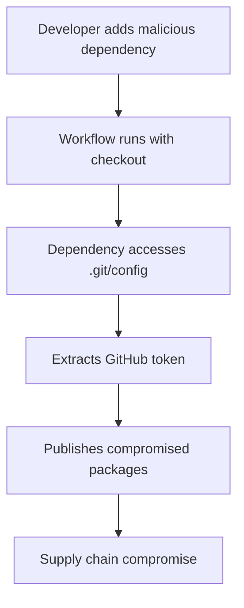
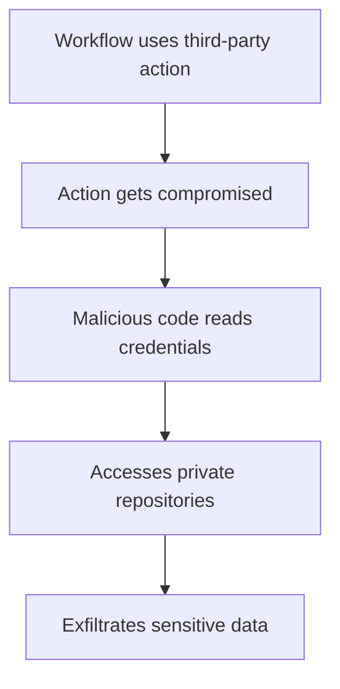
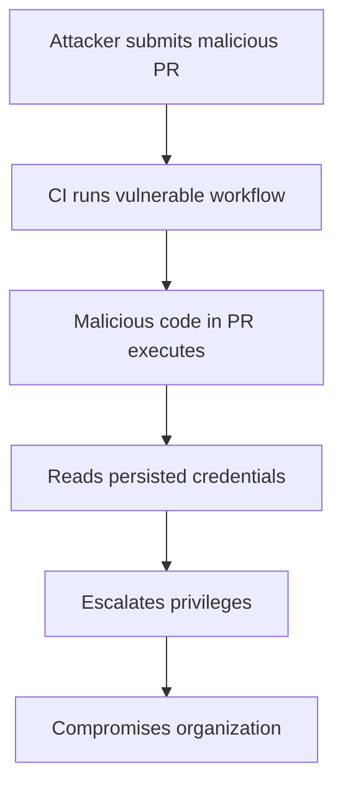

# Security Analysis: GitHub Actions Checkout Vulnerability

## Executive Summary

This repository demonstrates a critical security vulnerability in GitHub Actions workflows that use the `actions/checkout` action without proper credential management. The vulnerability allows malicious actors to access GitHub tokens and potentially compromise the entire software supply chain.

## Vulnerability Details

### CVE Information
- **Issue Reference**: [GitHub Actions Checkout Issue #485](https://github.com/actions/checkout/issues/485)
- **Severity**: High
- **Impact**: Supply Chain Compromise, Credential Exposure, Repository Access

### Technical Description

The `actions/checkout` action, by default, persists GitHub credentials in the `.git/config` file within the runner environment. This behavior enables any subsequent step in the workflow to access these credentials, creating multiple attack vectors:

1. **Direct Token Access**: Malicious code can read tokens from `.git/config`
2. **Environment Variable Exposure**: Sensitive data may be accessible through environment variables
3. **Supply Chain Injection**: Compromised packages/images can be published with legitimate credentials
4. **Lateral Movement**: Access to private repositories and organizational resources

## Attack Scenarios

### Scenario 1: Malicious Dependency


### Scenario 2: Compromised Action


### Scenario 3: Pull Request Attack


## Impact Assessment

### Immediate Risks
- **Credential Theft**: GitHub tokens exposed to all workflow steps
- **Repository Compromise**: Unauthorized access to private repositories
- **Package Poisoning**: Malicious packages published with legitimate credentials
- **Image Tampering**: Compromised container images in registries

### Long-term Consequences
- **Supply Chain Attacks**: Widespread distribution of malicious software
- **Reputation Damage**: Loss of trust in published packages/images
- **Compliance Violations**: Breach of security policies and regulations
- **Financial Impact**: Costs associated with incident response and remediation

## Mitigation Strategies

### Immediate Actions (Critical)
1. **Disable Credential Persistence**
   ```yaml
   - uses: actions/checkout@v4
     with:
       persist-credentials: false
   ```

2. **Implement Minimal Permissions**
   ```yaml
   permissions:
     contents: read
     # Only grant specific permissions as needed
   ```

3. **Review All Workflows**
   - Audit existing workflows for vulnerable configurations
   - Check for hardcoded secrets or tokens
   - Validate third-party action usage

### Enhanced Security Measures
1. **Secret Management**
   - Use GitHub's secret scanning
   - Implement secret rotation policies
   - Monitor secret usage and access

2. **Workflow Security**
   - Enable branch protection rules
   - Require workflow approval for external contributors
   - Implement security reviews for workflow changes

3. **Supply Chain Protection**
   - Use dependency scanning tools
   - Implement package signing and verification
   - Monitor published packages for tampering

4. **Monitoring and Detection**
   - Set up alerts for unusual repository activity
   - Monitor package/image publications
   - Implement audit logging for credential usage

## Detection Methods

### Indicators of Compromise (IoCs)
- Unexpected package publications
- Unusual repository access patterns
- Modified workflow files
- Unauthorized credential usage
- Suspicious environment variable access

### Monitoring Strategies
```bash
# Check for credential persistence in workflows
grep -r "persist-credentials" .github/workflows/

# Look for missing security configurations
grep -L "persist-credentials: false" .github/workflows/*.yml

# Monitor git configuration access
audit-log | grep ".git/config"
```

## Testing and Validation

### Security Testing Checklist
- [ ] Verify `persist-credentials: false` in all checkout actions
- [ ] Confirm minimal workflow permissions are set
- [ ] Test secret scanning and detection
- [ ] Validate third-party action security
- [ ] Review dependency vulnerability scanning
- [ ] Test incident response procedures

### Penetration Testing
This repository includes tools for safe penetration testing:
- `scripts/exploit-demo.sh` - Demonstrates vulnerability exploitation
- `vulnerable-workflow.yml` - Shows insecure configuration
- `secure-workflow.yml` - Shows proper security measures

## Compliance and Governance

### Industry Standards
- **NIST Cybersecurity Framework**: Implement proper access controls
- **SLSA (Supply-chain Levels for Software Artifacts)**: Ensure build integrity
- **OpenSSF Scorecard**: Maintain high security scores
- **OWASP Top 10**: Address supply chain security risks

### Organizational Policies
1. **Workflow Security Policy**
   - Mandatory security reviews for new workflows
   - Regular audits of existing workflows
   - Incident response procedures

2. **Secret Management Policy**
   - Proper secret rotation and lifecycle management
   - Access control and monitoring
   - Breach notification procedures

## References and Resources

### Official Documentation
- [GitHub Actions Security Best Practices](https://docs.github.com/en/actions/security-guides/security-hardening-for-github-actions)
- [Checkout Action Security](https://github.com/actions/checkout/blob/main/docs/advanced-usage.md#security)

### Security Research
- [GitHub Security Lab Research](https://securitylab.github.com/research/github-actions-preventing-pwn-requests/)
- [Supply Chain Attacks via GitHub Actions](https://blog.gitguardian.com/github-actions-supply-chain-attacks/)

### Tools and Scanners
- [GitHub Secret Scanning](https://docs.github.com/en/code-security/secret-scanning)
- [Semgrep for CI/CD Security](https://semgrep.dev/p/ci)
- [OSSF Scorecard](https://github.com/ossf/scorecard)

---

**⚠️ Disclaimer**: This analysis is for educational and security research purposes only. Always follow responsible disclosure practices and obtain proper authorization before testing security vulnerabilities.
